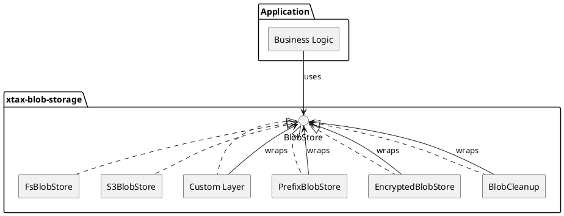
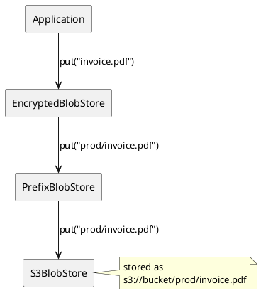
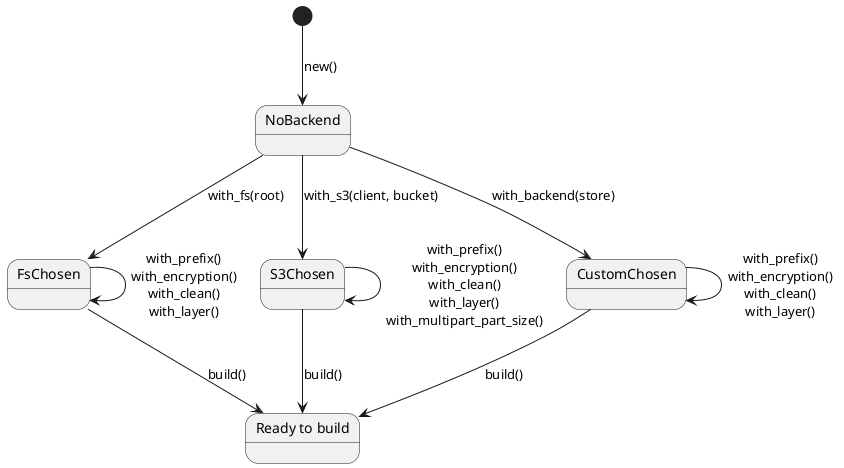
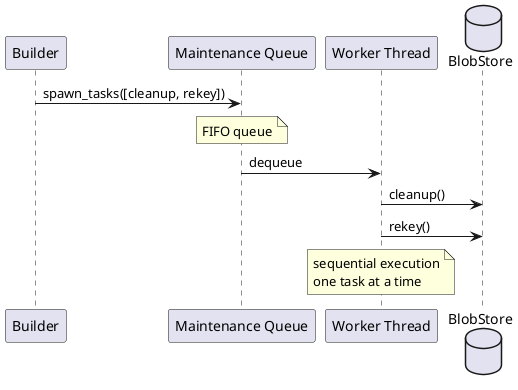

# Architecture

## Core principle: everything is a `BlobStore`

The library is built around a single async trait:

```rust
#[async_trait]
pub trait BlobStore: Send + Sync {
    async fn put(&self, blobs: Vec<BlobInput>) -> Result<PutResult>;
    async fn get(&self, key: &str) -> Result<Box<dyn AsyncRead + Send + Unpin>>;
    async fn delete(&self, keys: &[&str]) -> Result<()>;
    async fn list(&self, filter: &dyn ListFilter) -> Result<Vec<String>>;
    async fn exists(&self, key: &str) -> Result<bool>;
    async fn get_with_metadata(&self, key: &str) -> Result<(BlobMeta, Box<dyn AsyncRead + Send + Unpin>)>;
    async fn list_with_metadata(&self, filter: &dyn ListFilter) -> Result<Vec<BlobMeta>>;
    async fn visit(&self, filter: &dyn ListFilter, visitor: &mut dyn BlobVisitor) -> Result<()>;
}
```

**Every backend and every manipulation layer implements this same trait.** This is what makes them composable — you can wrap any `BlobStore` with another `BlobStore` without the application knowing.

## Layered architecture



## Layer stacking example

When you call:

```rust
BlobStoreBuilder::new()
    .with_s3(client, "bucket")
    .with_prefix("prod/")
    .with_encryption(provider)
    .build()
```

The resulting call chain looks like this:



## Layer ordering matters

Each layer wraps the previous one. The order in which you call `with_*` methods determines the wrapping order:

```rust
// Prefix → Encryption: keys are prefixed, then encrypted
// The prefix is visible on the encrypted key
.with_prefix("a/")
.with_encryption(p)
// Result: Encrypted(Prefix(Backend))

// Encryption → Prefix: the prefix is visible on the plaintext key
.with_encryption(p)
.with_prefix("a/")
// Result: Prefix(Encrypted(Backend))
```

## Typestate builder

The builder uses Rust's type system to enforce correct construction at compile time:



You **cannot** call `.build()` without setting a backend — the compiler rejects it.

## Maintenance queue

Cleanup and rekey tasks run on a shared sequential background worker:



All tasks execute in FIFO order on a single background worker. This ensures that cleanup and rekey operations don't run concurrently and don't interfere with each other.

## Key design decisions

| Decision | Rationale |
|----------|-----------|
| **`thiserror` for error types** | Library errors use `#[derive(thiserror::Error)]` — no manual `Display`/`Error`/`From` boilerplate. Each variant is a first-class `std::error::Error`. |
| **Trait-based, not enum-based** | Anyone can implement `BlobStore` for their own types. No exhaustive match needed. |
| **`Arc<dyn BlobStore>` everywhere** | Cheap clone, shared ownership, dynamic dispatch at layer boundaries only. |
| **Detached encryption headers** | Header stored separately from payload. Enables re-key without touching the data stream. |
| **`/` as universal separator** | Both FS and S3 backends use `/` as path separator. Keys are platform-independent. |
| **Best-effort metadata** | `stored_size` and `modified_at` are best-effort — suitable for approximate ordering, not exact accounting. |
| **Streaming I/O** | `get()` returns `Box<dyn AsyncRead>` — no buffering entire blobs in memory. |