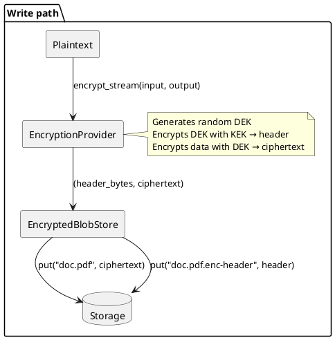
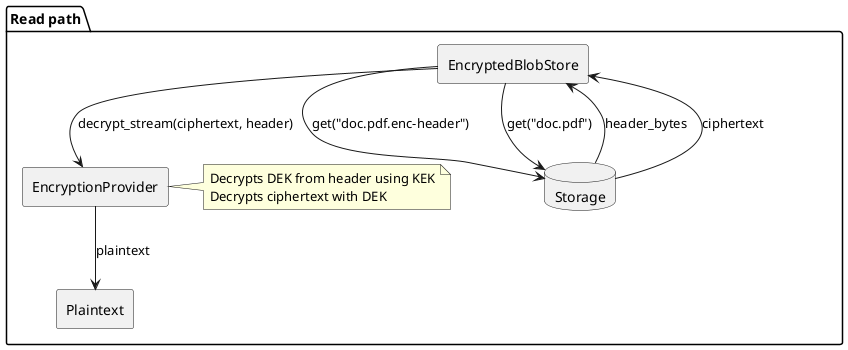
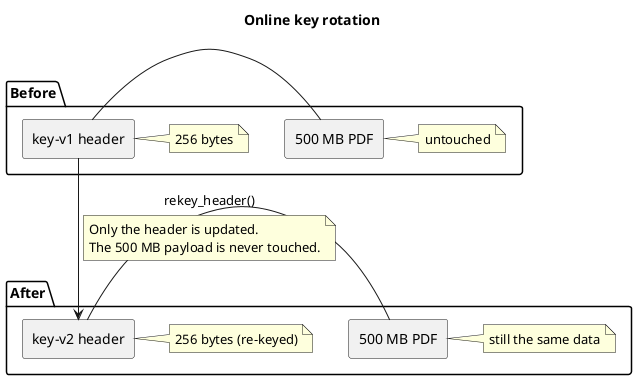

# Encryption

## Envelope encryption

`xtax-blob-storage` uses **envelope encryption** with **detached headers**. This means:

1. A data encryption key (DEK) is generated for each blob
2. The DEK is encrypted with a master key (KEK) — this is the "envelope"
3. The encrypted DEK (the header) is stored separately from the blob payload
4. The blob payload is encrypted with the DEK





## EncryptionProvider trait

To use encryption, you implement the `EncryptionProvider` trait:

```rust
#[async_trait]
pub trait EncryptionProvider: Send + Sync {
    /// Encrypt data from `input` and write the encrypted stream to `output`.
    /// Returns the serialisable encryption header.
    async fn encrypt_stream(
        &self,
        input: &mut (dyn AsyncRead + Send + Unpin),
        output: &mut (dyn AsyncWrite + Send + Unpin),
    ) -> Result<Vec<u8>>;

    /// Decrypt data from `input` using `header_bytes` and write plaintext to `output`.
    async fn decrypt_stream(
        &self,
        input: &mut (dyn AsyncRead + Send + Unpin),
        output: &mut (dyn AsyncWrite + Send + Unpin),
        header_bytes: &[u8],
    ) -> Result<()>;

    /// Try to re-key (re-wrap) an encryption header with the current master key.
    /// Returns `None` if the header is already using the current key.
    /// Returns `Some(new_header_bytes)` if the header was re-wrapped.
    async fn rekey_header(&self, header_bytes: &[u8]) -> Result<Option<Vec<u8>>>;
}
```

### Contract

- **`encrypt_stream`**: Reads all data from `input`, encrypts it, writes ciphertext to `output`. Returns the detached header bytes (nonce, encrypted DEK, algorithm identifier, etc.).
- **`decrypt_stream`**: Reads ciphertext from `input`, decrypts using `header_bytes`, writes plaintext to `output`.
- **`rekey_header`**: Decrypts the DEK from the old header using the old KEK, re-encrypts with the new KEK. Returns `None` if already using the current key.

### Example: No-op provider

```rust
use async_trait::async_trait;
use tokio::io::{AsyncRead, AsyncWrite, AsyncWriteExt, AsyncReadExt};
use xtax_blob_storage::{EncryptionProvider, Result};

struct NoopEncryption;

#[async_trait]
impl EncryptionProvider for NoopEncryption {
    async fn encrypt_stream(
        &self,
        input: &mut (dyn AsyncRead + Send + Unpin),
        output: &mut (dyn AsyncWrite + Send + Unpin),
    ) -> Result<Vec<u8>> {
        let mut buf = Vec::new();
        input.read_to_end(&mut buf).await.unwrap();
        output.write_all(&buf).await.unwrap();
        Ok(vec![])  // empty header
    }

    async fn decrypt_stream(
        &self,
        input: &mut (dyn AsyncRead + Send + Unpin),
        output: &mut (dyn AsyncWrite + Send + Unpin),
        _header_bytes: &[u8],
    ) -> Result<()> {
        let mut buf = Vec::new();
        input.read_to_end(&mut buf).await.unwrap();
        output.write_all(&buf).await.unwrap();
        Ok(())
    }

    async fn rekey_header(&self, _header_bytes: &[u8]) -> Result<Option<Vec<u8>>> {
        Ok(None)  // no rotation needed
    }
}
```

## Online key rotation

Because encryption headers are **detached** from the payload, key rotation only touches the header — the blob payload is never re-encrypted.



This allows millions of documents to be re-keyed incrementally in the background with minimal I/O.

### Configuration

```rust
use std::sync::Arc;
use std::time::Duration;
use xtax_blob_storage::{BlobStoreBuilder, Manual, Periodic};

// Run every 24 hours
let store = BlobStoreBuilder::new()
    .with_fs("/tmp/data")
    .with_encryption(provider.clone())
    .with_rekey(Arc::new(Periodic(Duration::from_secs(86400))))
    .build().await?;

// Or trigger manually
let manual = Arc::new(Manual::new());
let store = BlobStoreBuilder::new()
    .with_fs("/tmp/data")
    .with_encryption(provider)
    .with_rekey(manual.clone())
    .build()
    .await?;

manual.trigger();
```

The rekey task runs on the shared sequential maintenance queue. It iterates over all blobs, reads each header, calls `rekey_header()`, and writes back the updated header if needed.

### Background strategies

| Strategy | Behaviour |
|----------|-----------|
| `OnStart` | Runs once when the store is built |
| `Periodic(duration)` | Runs repeatedly at the given interval |
| `Manual::new()` | Runs when `Manual::trigger()` is called |

## Header storage

Encryption headers are stored as separate blobs with a `.enc-header` suffix:

| Blob | Content |
|------|---------|
| `doc.pdf` | Encrypted payload (ciphertext) |
| `doc.pdf.enc-header` | Encryption header (nonce, encrypted DEK, algorithm) |

The `EncryptedBlobStore` layer automatically:
- Filters out `.enc-header` blobs from `list()` results
- Manages header lifecycle during `put()`, `get()`, `delete()`
- Handles header updates during `rekey()`

## Failure semantics

### Non-atomic writes

`put()` is **not an atomic operation** across the two backend objects. The encrypted blob store writes the ciphertext data blob first, then writes the detached encryption header as a separate blob. If the process crashes or the header write fails between these two steps, the store enters an inconsistent state.

```
  put("doc.pdf")
  │
  ├── 1. put("doc.pdf")           ← encrypted data
  │      │                          (may succeed while step 2 fails)
  │
  └── 2. put("doc.pdf.enc-header") ← encryption header
         │                          (may fail independently)
```

There are two backend objects and each write operation is independent. The
encrypted layer does **not** provide a two-phase commit or any transactional
guarantee across the pair.

### Failure scenarios

#### Orphan data blob (no header)

**Trigger**: A crash, power loss, or network partition occurs after the data
blob is stored but before the header blob is written. Alternatively, the header
write fails and the best-effort rollback of the data blob also fails.

**Observable outcome**:
- `exists(key)` → `false` (requires both objects)
- `get(key)` → `BlobStorageError::NotFound(key)`
- `list()` does not include this key (orphan data is filtered out)
- `list_with_metadata()` does not include this key

**Recovery**: Re-`put`ing the same key overwrites the orphan data blob and
writes a fresh header, restoring the blob to a consistent state.

**Storage impact**: The orphan data blob consumes storage space but is
invisible to all read paths. A separate storage-audit tool that bypasses the
encryption layer would be needed to detect and remove these leaks.

#### Orphan header blob (no data)

**Trigger**: On an **overwrite** of an existing key, the new data blob is
stored successfully, but the new header write fails. The rollback deletes the
new data blob, but the **old** header blob from the previous version remains
— now without any corresponding data blob.

**Observable outcome**:
- `exists(key)` → `false` (data blob is missing)
- `get(key)` → `BlobStorageError::NotFound(key)` (the data blob `get()` returns NotFound)
- `list()` does not include this key (the data blob is absent, so it isn't even a candidate)
- `list_with_metadata()` does not include this key

**Recovery**: Re-`put`ing the same key writes both a new data blob and a new
header, restoring the blob to a consistent state.

**Storage impact**: The orphan header blob (typically hundreds of bytes)
consumes negligible storage. It is invisible to all read paths.

#### Unreadable blob (header corruption or key mismatch)

**Trigger**: The encryption header is present but corrupted, or was written
with a different master key that the current `EncryptionProvider` cannot
decrypt.

**Observable outcome**:
- `exists(key)` → `true` (both objects exist)
- `get(key)` returns an `AsyncRead` stream, but reading to EOF surfaces an
  I/O error (`ErrorKind::Other`) wrapping an `Encryption` error
- `list()` includes this key normally
- `list_with_metadata()` includes this key normally

**Recovery**: If the header is simply stale (wrapped with an old key), call
`rekey()` to re-wrap it with the current master key. If the header is
genuinely corrupted, the blob must be re-uploaded.

#### Cleanup interaction

`BlobCleanup` uses `visit()` (which delegates to `list()`-based enumeration
in the encrypted store) to discover blobs to delete. Because orphan data
blobs and orphan header blobs are invisible to `list()`, they cannot be
discovered and deleted by `BlobCleanup`.

- **Orphan data blobs** survive cleanup and continue to consume storage.
- **Orphan header blobs** survive cleanup (negligible storage impact).
- Valid blobs matched by the cleanup predicate are deleted correctly — both
  the data blob and the header blob are removed in a single batch `delete()`.

#### Overwrite partial failure

When overwriting an existing key, the sequence is:

1. Write new data blob (overwrites old data)
2. Write new header blob (overwrites old header)
3. If step 2 fails → rollback: delete new data blob

After rollback, the old header blob **may** still exist (if it was not deleted
during step 1's overwrite — data and header are separate objects). The key
becomes unusable until re-written.

### Summary table

| Scenario | `exists()` | `get()` | `list()` | Storage impact | Recovery |
|---|---|---|---|---|---|
| Normal | `true` | decrypted data | included | both objects | — |
| Orphan data | `false` | `NotFound` | excluded | **leaked** data blob | re-`put()` |
| Orphan header | `false` | `NotFound` | excluded | negligible header | re-`put()` |
| Corrupt header | `true` | I/O error on read | included | both objects | `rekey()` or re-`put()` |
| Stale header | `true` | decrypted data | included | both objects | `rekey()` |

### Error propagation

The encrypted layer propagates non-`NotFound` errors (storage errors, permission denied, etc.) from the inner backend unchanged. Only a genuine `NotFound` from the inner store is mapped to `NotFound` in the encrypted layer's return type.

### Batch delete

`delete()` with a `BatchError` from the inner store filters out internal `.enc-header` keys from both `errors` and `succeeded`, ensuring callers never see internal keys.
